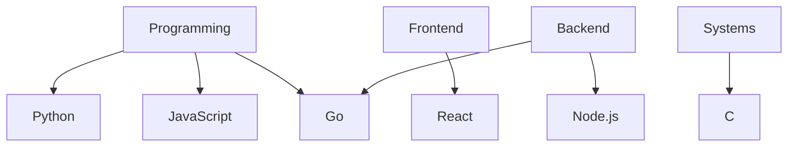

# Hi there, I'm Sc4rlx-Dev! 👋

Welcome to my GitHub profile! I'm a passionate developer who loves building innovative projects, learning new technologies, and collaborating with awesome people.

---

## 🔧 Technologies & Tools
- **Languages**: Python, JavaScript, Golang
- **Frameworks**: React, Node.js
- **Tools**: Git, Docker, Kubernetes
- **Databases**: MySQL, PostgreSQL, MongoDB

---

## 🚀 Projects
Here are some of the cool projects I've been working on:
- [Project Name 1](https://github.com/Sc4rlx-Dev/project1): A brief description of what this project does.
- [Project Name 2](https://github.com/Sc4rlx-Dev/project2): Another project with a short description.

---

## 📈 GitHub Stats

---

# Skills Diagram

## 💬 Let's Connect
- 💼 [LinkedIn](https://www.linkedin.com/in/oussama-er-raoui/)
- 🌐 [Portfolio](-)
- 📧 [Email](itsscarl2022@gmail.com)

Feel free to explore my repositories and connect with me! 😊
